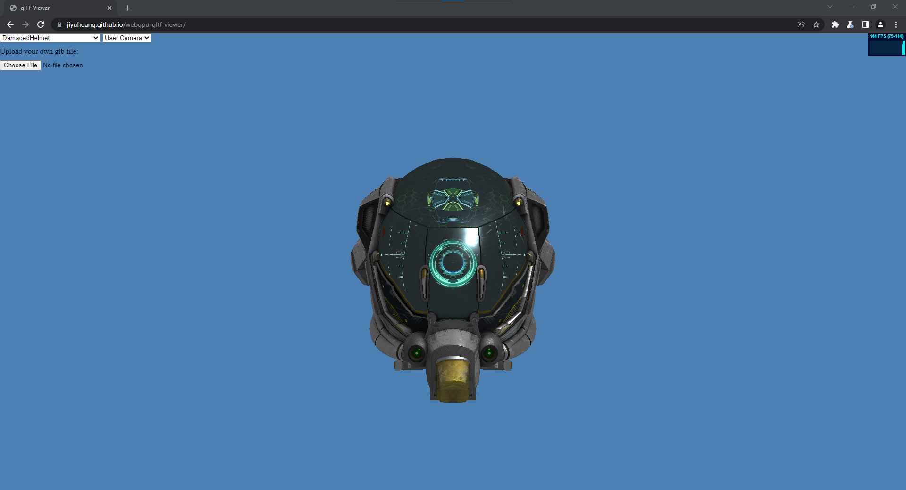

# WebGPU Based glTF 2.0 Viewer

**University of Pennsylvania, CIS 565: GPU Programming and Architecture, Final Project**

by [Jiyu Huang](https://jiyuhuang.github.io/)

This is a physically-based rendering engine for loading and displaying glTF 2.0 files, using the emerging WebGPU API.

## Live Demo

[Live Demo Link](https://jiyuhuang.github.io/webgpu-gltf-viewer/). Requires browsers with WebGPU support (for example, Google Chrome Canary or Chrome Dev with `enable-unsafe-webgpu` flag on).

## Screenshots

## Features

### Formats

- [x] glTF
- [ ] glTF-Embedded
- [x] glTF-Binary

### glTF 2.0 Core Features

- [x] Accessors
  - [ ] Sparse Accessors
- [x] Buffers and Buffer Views
- [x] Cameras
  - [x] Perspective
  - [x] Orthographic
- [x] Images
- [x] Materials
  - [x] Metallic-Roughness Material
  - [x] Additional Textures
  - [x] Alpha Coverage
- [x] Meshes (topology type: triangles only)
- [x] Nodes
- [x] Samplers
- [x] Scenes
- [x] Textures
- [x] Animations
  - [ ] Cubic Spline Interpolation
- [ ] Skins

### Extensions

- [x] EXT_mesh_gpu_instancing

## Usage

### Controls

- camera rotation: drag and move
- zoom in/out: scroll in/out

### Local Installation

For local usage, follow these instructions:

1. Download the repository and make sure npm package manager is installed
2. Run `npm install`
3. Run `npm start`
4. Go to `http://localhost:8080/` using a browser that has WebGPU enabled

## Next Steps

1. Skinning and morph target animation
2. Complete core glTF 2.0
3. Image-based lighting
4. Material extensions

## References

- [WebGPU Samples](https://github.com/austinEng/webgpu-samples)
- Alain's [Raw WebGPU](https://alain.xyz/blog/raw-webgpu) tutorial
- [Khronos glTF 2.0 Sample Viewer](https://github.com/KhronosGroup/glTF-Sample-Viewer) and [minimal-gltf-loader](https://github.com/shrekshao/minimal-gltf-loader) for metallic-roughness shading implementation details
