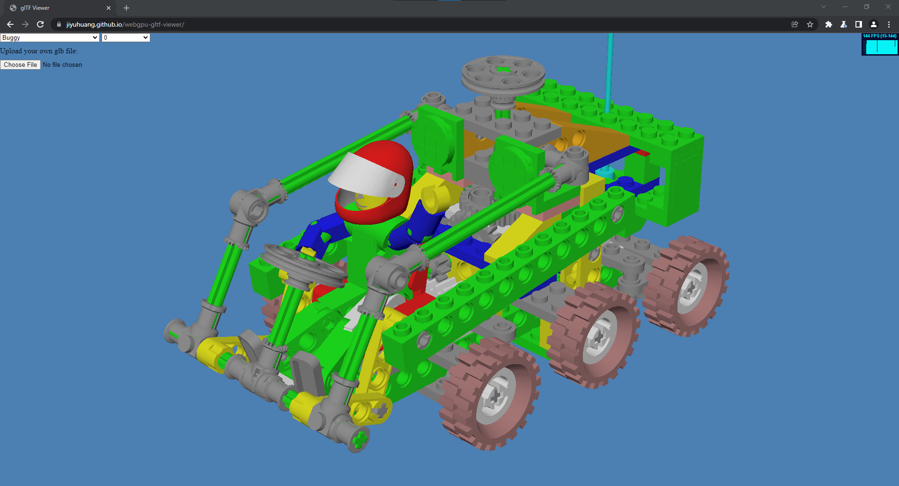

# WebGPU Based glTF 2.0 Viewer

**University of Pennsylvania, CIS 565: GPU Programming and Architecture, Final Project**

by [Jiyu Huang](https://jiyuhuang.github.io/)

[Live Demo](https://cis565-team6.github.io/webgpu-gltf-viewer/) (Requires Google Chrome Canary with `--enable-unsafe-webgpu` flag enabled)

## Screenshots

  
  
  
  

## Features

### Formats

- [x] glTF
- [ ] glTF-Embedded
- [x] glTF-Binary

### glTF 2.0 Core Features

- [x] Accessors
  - [ ] Sparse Accessors
- [x] Buffers and Buffer Views
- [x] Cameras
- [x] Images
- [x] Materials
- [x] Meshes
  - Topology types: triangles only
- [x] Nodes
- [x] Samplers
- [x] Scenes
- [x] Textures
- [ ] Animations
- [ ] Skins

### Extensions

- [x] EXT_mesh_gpu_instancing

## Credits

- [Khronos glTF 2.0 Sample Viewer](https://github.com/KhronosGroup/glTF-Sample-Viewer)
